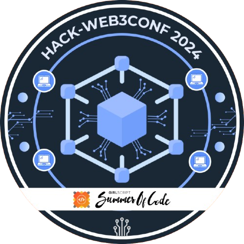

<h1 align="center"> Yo!!! I'm Vansh </h1>

 
  
  

  
 Coding is my love language :) 

  
   
  
<strong>"🎓 College. ☕️ Coffee. 💻 Code. Repeat."   Vibing to: 🎧</strong>

 
<h3> Languages, Tools and Technologies 🚀 </h3>
<table>
	<tr>
	<td><strong>Programming Languages</strong></td>
	<td></td>
</tr>
<tr>
	<td><strong>Database Technologies</strong></td>
	<td></td>
</tr>
<tr>
	<td><strong>Frontend Development</strong></td>
	<td></td>
</tr>
<tr>
	<td><strong>Backend Development</strong></td>
	<td></td>
</tr>

<tr>
	<td><strong>Frameworks</strong></td>
	<td></td>
</tr>

<tr>
	<td><strong>Developer Tools</strong></td>
	<td></td>
</tr>

<tr>
	<td><strong>Data Analysis</strong></td>
	<td></td>
</tr>

</table>
 

## :zap: Open Source Programs & Achievements

  <table>
    <tr align="center">
      <td style="border-right: 1px solid #dddddd; padding: 15px;" valign="top" width="50%">
        <a href="">
          
           
          <strong>GirlScript Summer of Code Extended</strong>
        </a>
         
        🏅 Ranked 145th
         
        
	  Out of 17,000+ participants 
          PRs Merged: 22 
          Total Badges: 6+ 
          Total Score: 1270 
        
      </td>
      <td style="padding: 15px;" valign="top" width="50%">
        <table>
          <tr align="center">
            <td style="border-right: 1px solid #dddddd; padding: 10px;" width="100">
              
               
              <strong>Explorer Badge</strong>
            </td>
            <td style="border-right: 1px solid #dddddd; padding: 10px;" width="100">
              
               
              <strong>Adventurer Badge</strong>
            </td>
            <td style="border-right: 1px solid #dddddd; padding: 10px;" width="100">
              
               
              <strong>Champion Badge</strong>
            </td>
            <td style="padding: 10px;" width="100">
              
               
              <strong>Trailblazer Badge</strong>
            </td>
          </tr>
          <tr align="center">
            <td style="border-right: 1px solid #dddddd; padding: 10px;" width="100">
              
               
              <strong>Summit Seeker Badge</strong>
            </td>
            <td style="border-right: 1px solid #dddddd; padding: 10px;" width="100">
              
               
              <strong>Innovator Badge</strong>
            </td>
            <td style="border-right: 1px solid #dddddd; padding: 10px;" width="100">
              
               
              <strong>Web3 Hack Badge</strong>
            </td>
            <td style="padding: 10px;" width="100">
              
               
              <strong>API Student Expert</strong>
               
              Postman
            </td>
          </tr>
        </table>
      </td>
    </tr>
  </table>

 

  <table>
    <tr align="center">
      <td style="border-right: 1px solid #dddddd; padding: 15px;" valign="top" width="50%">
        <a href="">
          
           
          <strong>GirlScript Summer of Code</strong>
        </a>
         
        🏅 Ranked 100th 
         
        
          2-month program 
          PRs Merged: 23 
          Total Badges: 3 
          Total Score: 183 
        
      </td>
      <td style="padding: 15px;" valign="top" width="50%">
        <table>
          <tr align="center">
            <td style="border-right: 1px solid #dddddd; padding: 10px;" width="100">
              
               
              <strong>Explorer Badge</strong>
            </td>
            <td style="border-right: 1px solid #dddddd; padding: 10px;" width="100">
              
               
              <strong>Adventurer Badge</strong>
            </td>
            <td style="padding: 10px;" width="100">
              
               
              <strong>API Student Expert</strong>
               
              Postman
            </td>
          </tr>
        </table>
      </td>
    </tr>
  </table>

 

<!-- Connect with Me Section -->
<h2 align="center">Connect with Me</h2>

 

